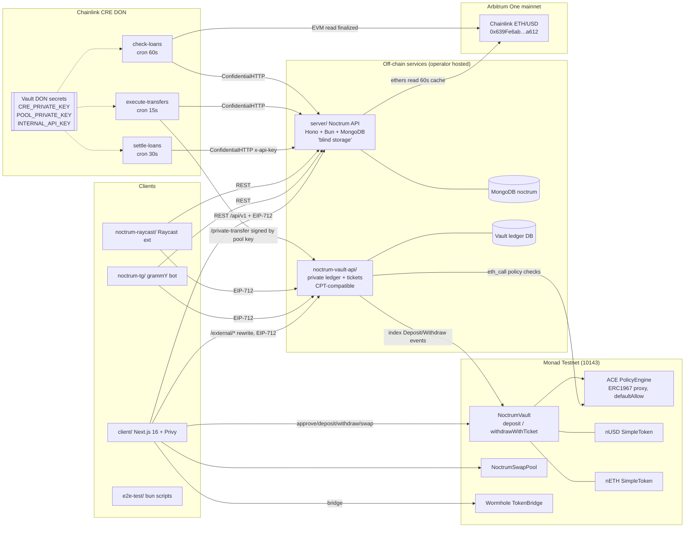
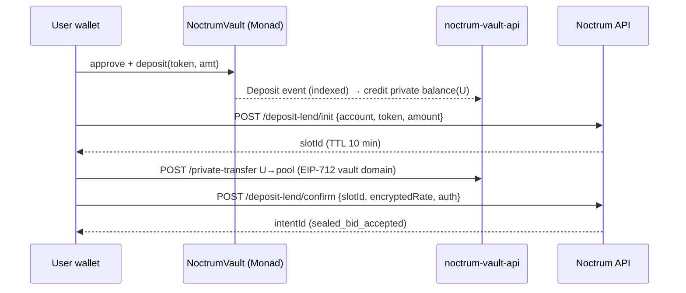
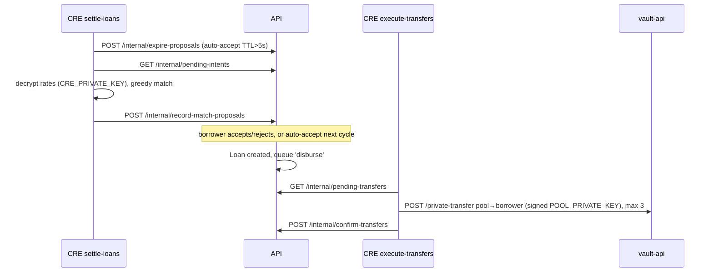

# Noctrum — Architecture

Noctrum copies Ghost's three-trust-domain design. The one structural change: Ghost relied on Chainlink's Sepolia-only hosted **Compliant Private Token (CPT)** vault and API. Noctrum self-hosts a wire-compatible equivalent on Monad Testnet: `NoctrumVault.sol` plus the `noctrum-vault-api` service.

## 1. System diagram

## 2. Components

| Component | Ghost path | Noctrum path | Tech | Role |
|---|---|---|---|---|
| API server | `server/` | `server/` | Bun, Hono 4.12, Mongoose 9, ethers 6, eciesjs | Intents, proposals, loans, credit scores, transfer queue, quotes. Cannot decrypt rates or move funds. |
| CRE workflows | `ghost-settler/` | `noctrum-settler/` | `@chainlink/cre-sdk` (1.1.x), viem, eciesjs | Matching, transfer execution, liquidation |
| Custody (on-chain) | Chainlink CPT vault `0xE588a6c7…2d13` (Sepolia, **external**) | `contracts/src/NoctrumVault.sol` (**new, we deploy**) | Solidity 0.8.26, OZ 5.5, Chainlink ACE v1.0.0 | Holds ERC20s; emits Deposit/Withdraw; redeems tickets |
| Custody (off-chain) | `https://convergence2026-token-api.cldev.cloud` (**external**) | `noctrum-vault-api/` (**new, we run**) | Bun + Hono + Mongo (proposed) | Private balances, private transfers, shielded addresses, tx history, withdrawal tickets |
| Tokens | `SimpleToken` gUSD/gETH | `SimpleToken` nUSD/nETH | OZ ERC20+Permit | Test assets |
| Swap pool | `GhostSwapPool` `0xF683c97a…B08B` | `NoctrumSwapPool` | Solidity | Owner-priced swap |
| Web app | `client/` | `client/` | Next 16.1.6, React 19.2.3, Privy 3.16, ethers 6, Wormhole SDK, Tailwind 4, shadcn | Main UI |
| Marketing site | `frontend/` | `frontend/` | Next 15, framer-motion, lenis | Landing |
| Telegram bot | `ghost-tg/` | `noctrum-tg/` | grammY, WalletConnect sign-client v2 | Chat UI |
| Raycast | `ghost-raycast/` | `noctrum-raycast/` | @raycast/api | Desktop UI |
| E2E | `e2e-test/` | `e2e-test/` | Bun scripts | Integration tests |
| Docs | `docs/` | `docs/` | Docusaurus 3.9.2 | Public docs |

## 3. Data flows

### 3.1 Lend

### 3.2 Match → accept → disburse

### 3.3 Liquidation
check-loans → `POST /internal/check-loans` → read the Arbitrum feed → compute health → `POST /internal/liquidate-loans` → the server queues `liquidate` transfers → execute-transfers pays out.

### 3.4 Withdraw
User → vault-api `/withdraw` → ticket (nonce‖deadline‖sig, 89 bytes, valid 1 h) → `NoctrumVault.withdrawWithTicket(token, amount, ticket)` → Withdraw event → vault-api marks it completed. An unredeemed ticket is refunded after the deadline.

## 4. Trust assumptions

| Actor | Trusted for | Not trusted for / mitigations |
|---|---|---|
| Noctrum API server | Liveness, correct bookkeeping. **Fully trusted for accounting.** It does not verify on-chain deposits or private transfers before creating intents (`confirmDepositLend`, `submitBorrowIntent`, `repayLoan` trust the client). Same as Ghost. | Cannot read rates (ciphertext only). Cannot move funds (no pool key; `POOL_PRIVATE_KEY` is optional and only used to show `poolAddress`). |
| CRE DON | Decrypting rates, honest matching, signing transfers with the pool key, reading the price | Threshold secrets; key material only inside the workflow execution |
| noctrum-vault-api (new) | Private balance ledger, transfer authorization, ticket issuance. **New trust point.** In Ghost this was Chainlink's hosted service; now the Noctrum operator runs it. | Users can always verify on-chain totals. Tickets are bound to account, token, amount, nonce and deadline. |
| NoctrumVault | Custody | Owner/admin can register tokens. Ticket signer key is critical. |
| Chainlink ETH/USD (Arbitrum) | Price | `latestAnswer` without a staleness check (as Ghost) |
| Pool wallet (EOA) | Holds all pooled private balance | Key lives only in DON secrets (and in the server's env if set) |
| Wormhole guardians | Bridge attestations | — |

## 5. Privacy model (unchanged)

| Data | API server | CRE | Vault API | On-chain |
|---|---|---|---|---|
| Lend/borrow rates | ciphertext | plaintext (ephemeral) | — | never |
| Amounts, addresses | visible | visible | visible | deposits/withdrawals only |
| Credit scores | visible | visible | — | no |
| Transfers between users | queued (visible) | visible | visible | never |

## 6. Deployment topology (proposed, mirrors Ghost)

- API: Docker (`oven/bun:1`, port 8080) behind HTTPS. Ghost used `https://do.roydevelops.tech/ghost-server/api/v1`; Noctrum's host is ⚠️ TBD (D-9).
- vault-api: Docker, HTTPS, separate DB and keys.
- Web: Vercel or similar. Next.js rewrites `/api/v1/*`, `/health` and `/external/*`.
- Telegram bot: Docker with a persistent volume at `/app/data`.
- CRE: deployed to the Chainlink DON via `cre workflow deploy` (requires CRE account access).
